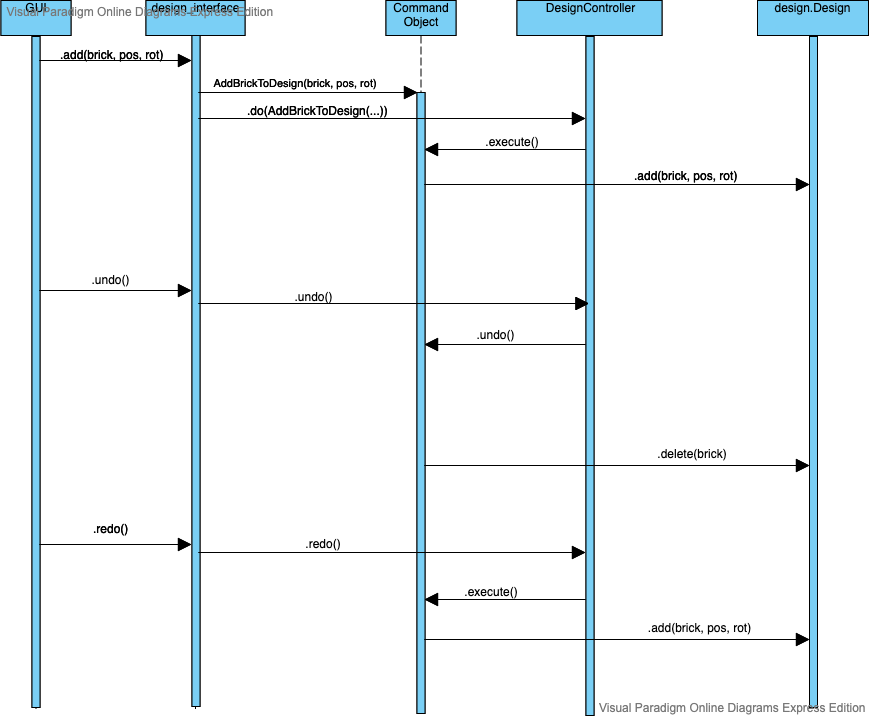

# DesignHistory
### Demo and Writeup of Mike's Part of Team Design's work
**History management: Undo/Redo functionality**

Here I have written my code for my final assignment in Fordham's CISC 6100--software engineering. 

The project is supposed to be a team project, but due to some lapses in communication and availability aligment, I ended up re-coding 
portions of the assignment given to other teammates here. I would like to emphasize that ***This is not the fault of my teammates*** it is simply a fault of circumstance. 

## Overview

My code sits at the highest level of abstraction for Team Design and thus interfaces most with the rest of the teams, but it also relies on many details from below. I stubbed those out as best I could.

For the program modules, working from low-level to high-level modules, we have

| Module              | Description                                                                                                                                                                                                                        |
|---------------------|------------------------------------------------------------------------------------------------------------------------------------------------------------------------------------------------------------------------------------|
| brick.py            |  `brick.Brick` is the simplest design unit.   A brick has an ID, a position and an orientation.                                                                                                                                                     |
| designspace.py      |  `designspace.design` is singleton container for bricks to live inside of.   Supports add, move, and delete operations.                                                                                                                                  |
| commands.py         |  Provides three command pattern wrappers to `designspace.design`: `AddBrickToDesign`, `MoveBrickInDesign`, and `DeleteBrickFromDesign`. These allow operations to be neatly undone                                                                                                            |
| designcontroller.py |  `designcontroller.DesignController` executes the commands from `commands.py`, maintains undo/redo history, and provides `undo` and `redo` methods which operate globally over the design space's state.
| design_interface.py | A thin wrapper to designcontroller.py which hides information for the user (i.e. other teams on the project).                                                                                                                      |

You should read the modules from the top down or the bottom up, depending on your mood.

The test modules are all self-explanatory, with the exception of `test_design_space_ABC`, which just houses a common `setUp` method for multiple test
suites (*ergo* it is not a *true* ABC, but this wording makes it more easily recognizable as relatively abstract). 

## UML Diagram: 

To illustrate how this code works, I went with a sequence diagram that ilustrates a hypothetical sequence of `.add()`, `undo()`, and `redo()` calls coming into our system from the GUI. More examples can be found in my test suite. This should drive an intuition of how the code works.

You can see that all of the classes exist before the first call except for the Command Object (in this case an `AddBrickToDesign` objecT) which is created by the `design_interface.add()` method and persists afterwards. It will live in the undo or redo stack until it is overwritten and (presumably) picked up by the garbage collector. 

Note that all modules, classes, and methods are documented inline with the code and demonstrated further in the test suites.

One weakness of the current design is that bricks persist forever, even after they are removed from the design. Not sure if we want garbage collection to worry about this since our program is interactive. This is a question for the entire group and cannot be addressed now.

## Installation and Usage
To clone this code to your machine, just run `git clone http://www.github.com/miketynes/DesignHistory` from whatever directory you want my code to haunt forever. 

Running the code requires only a `python3` interpreter. I used `python3.6.9` on an Ubuntu 18.04.1 system. 

To run the tests, **from the project's root directory** run `python -m unittest discover test`

## API reference

**Note:** All methods return `None` so return type is ommitted. Additionally, all methods are documented at greater detail inline. A good next step would be to automate documentation generation with a tool like [sphinx](http://www.sphinx-doc.org/en/master/)

| Method Name                                           |              | Details                                                                                     | Overview                                               |
|-------------------------------------------------------|--------------|---------------------------------------------------------------------------------------------|--------------------------------------------------------|
| `design_interface.add(brick, position, orientation)`  |              |                                                                                             | Add a brick to the design space                        |
|                                                       | `parameters` |  `brick`: a brick object   `position`: a list of 3 floats `orientation`: a list of 3 floats |                                                        |
|                                                       | `raises`     | `ValueError`: if you try to add a brick more than once                                      |                                                        |
| `design_interface.move(brick, position, orientation)` |              |                                                                                             | Move a brick to a new location in the design space     |
|                                                       | `parameters` | `brick`: a brick object   `position`: a list of 3 floats `orientation`: a list of 3 floats  |                                                        |
|                                                       | `raises `    | `ValueError`: if you try to move a brick that isn't in the design yet                       |                                                        |
| `design_interface.delete(brick)`                      |              |                                                                                             | Remove a brick from the design                         |
|                                                       | `parameters` | `brick`: a brick object                                                                     |                                                        |
|                                                       | `raises`     | `ValueError`: if you try to delete a brick that isn't in the design                         |                                                        |
| `design_interface.undo(n)`                            |              |                                                                                             | Undo the past `n` changes to the design space          |
|                                                       | `parameters` | `n` an integer: the number of elements of the undo stack to undo. Default = 1.              |                                                        |
|                                                       | `raises`     | `EmptyUndoStackError` if you try to undo more items than are in the undo stack              |                                                        |
| `design_interface.redo(n)`                            |              |                                                                                             |                                                        |
|                                                       | `parameters` | `n` an integer: the number of elements of the redo stack to redo. Default = 1.              | Redo the past `n` undo operations in the design space. |
|                                                       | `raises`     | `EmptyRedoStackError` if you try to redo more items than are in the undo stack              |                                                        |
